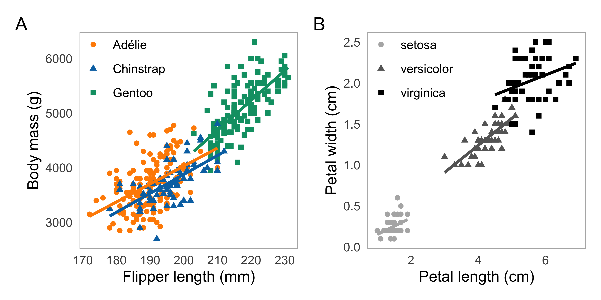
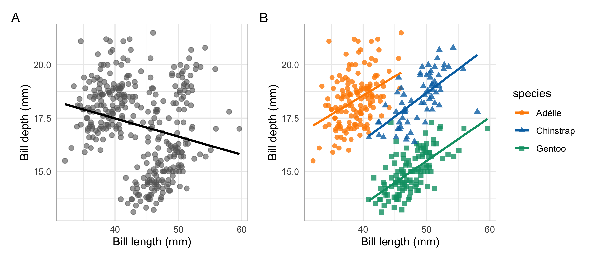
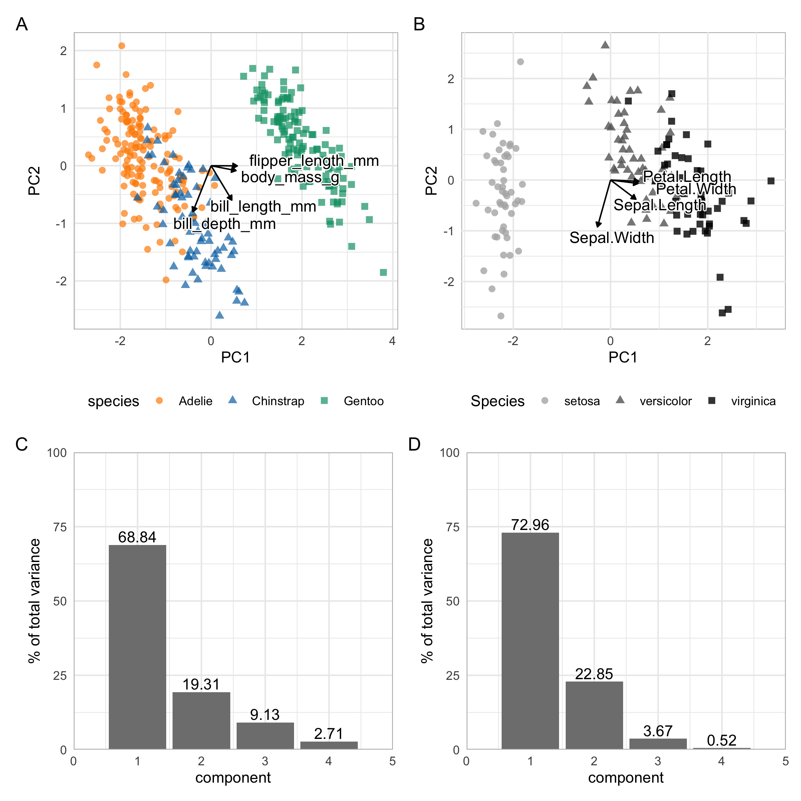
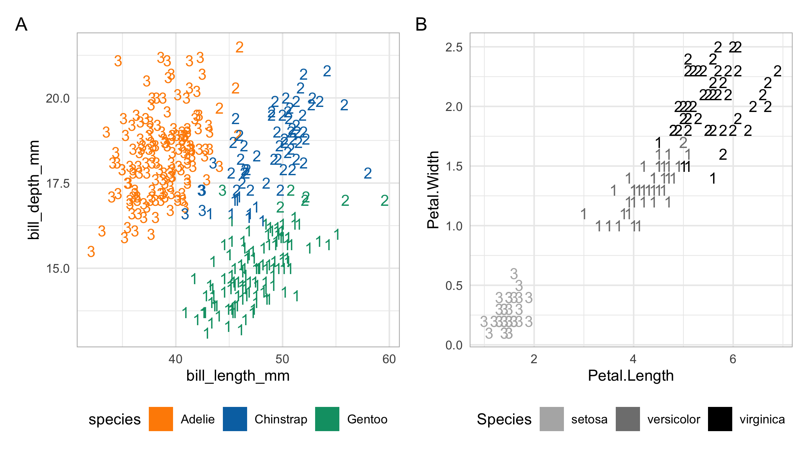

```{r setup, include=FALSE}
library(tidyverse)
library(here)
library(palmerpenguins)
library(kableExtra)
library(patchwork)
library(gt)
library(GGally)
library(recipes)
library(shadowtext)
library(broom)
knitr::opts_chunk$set(echo = TRUE)

theme_set(theme_minimal())
```

## Introduction

<!---Introductory section which may include references in parentheses
[@R], or cite a reference such as @R in the text.--->

In 1935, American botanist Edgar Anderson measured petal and sepal structural dimensions (length and width) for 50 flowers from three Iris species: *Iris setosa*, *Iris versicolor*, and *Iris virginica* [@anderson_irises_1935]. The manageable but non-trivial size (5 variables and 150 total observations) and characteristics of the data, including linear relationships and multivariate normality, make it amenable for introducing a wide range of statistical methods including data wrangling, visualization, regression, multivariate exploration, and machine learning. Anderson's *Iris* dataset is built into a number of software packages including the auto-installed datasets package in R [@r_core_team_r_2019], Python's scikit-learn machine learning library [@pedregosa_scikit-learn_2011], and the SAS Sashelp library (SAS Institute, Cary NC), which have facilitated widespread use of the data. As a result, eighty-five years after the data were initially published, Anderson’s *Iris* measurements are ubiquitous in statistics, computational methods, and data science courses and materials. 

There are a number of reasons that practitioners and educators may want to retire Anderson's *Iris* dataset in their modern data science materials. Anderson's *Iris* dataset lacks metadata almost entirely [@anderson_irises_1935], limiting meaningful interpretation and discussion of research methods, analyses, and outcomes. Of five variables in the dataset, two (`Sepal.Width` and `Sepal.Length`) are unintuitive for most non-botanists, and even with explanation the difference between *Iris* *petal* and *sepal* dimensions is not obvious. The *Iris* dataset contains only complete cases (there are no missing values) and equal sample size for all 3 species (*n* = 50 for all), which is cleaner than most real-world datasets learners are likely to encounter "in the wild." The single factor (`Species`) in the *Iris* data limits options for analyses. Finally, due to their publication in (and inextricable connection to) eugenicist and statistician R.A. Fisher's 1936 paper in *Annals of Eugenics* [@fisher_use_1936], the *Iris* dataset is burdened by a history in racist research. 

<!---**Sounds great. Why consider replacing iris?**

In 1936, one year after being described in the Bulletin of the American Iris Society, Anderson’s *Iris* measurements were published in full by eugenicist and statistician Ronald A. Fisher in *Annals of Eugenics* [@fisher_use_1936]. Regardless of Anderson's initial motivation, the data today remain inextricably linked to Fisher’s eugenics research and are even commonly, if unfairly, referred to as "Fisher's iris data.” For example, an August 2020 search for “Iris flower data set” in Wikipedia returns an article beginning with “The iris flower data set or Fisher’s iris data…”, then later in the article: “It is sometimes called Anderson's Iris data set” [@wikipedia_iris_2020]. The *Iris* dataset is similarly credited to Fisher in statistical computing literature [@trendafilov_simple_2009, @wang_matlab_2015, @woods_how_2015, @chen_unsupervised_2018].

There is recent momentum to address Fisher’s racist legacy in statistics. In June 2020, the Committee of Presidents of Statistical Societies’ R.A. Fisher Award and Lectureship was replaced by the Distinguished Achievement Award and Lectureship, to “advance a more just, equitable, diverse, and inclusive statistical community” [@noauthor_institute_2020]. Cambridge University’s Gonville and Caius College recently announced plans to remove a stained-glass window celebrating Fisher from a campus dining hall [@noauthor_sir_2020]. In the R community, there are calls to (1) address the *Iris* dataset's use in Fisher’s eugenics work, and/or (2) consider using a different dataset [@poisot_timothee_its_2020, @garrick_aden-buie_lets_2020]. --->

Given these motivations to retire *Iris*, we sought to identify, then make readily available, a suitable alternative dataset. Considering the positive and negative characteristics of the *Iris* dataset in data science and statistics materials, we established the following criteria for a suitable alternative:

- Available by appropriate license (ideally, CC0 "no rights reserved")
- Features intuitive subjects and variables that are interesting and understandable to learners across fields
- Complete metadata and documentation
- Manageable (but not trivial) in size
- Minimal data cleaning and pre-processing required for most analyses
- Real-world (not manufactured), modern data
- Similar opportunities for teaching and learning R, data science, and statistical skills
- Can easily replace *Iris* for most use cases

Here, we describe an alternative to Anderson's *Iris* data that largely satisfies these criteria: a refreshing, approachable and charismatic dataset containing real-world morphological data for three *Pygoscelis* penguin species that breed throughout the Western Antarctic Peninsula region, made available through the Long-Term Ecological Research Network (US LTER). By comparing data structure, size, and a range of analyses side-by-side for the two datasets, we demonstrate that the Palmer Archipelago penguin measurements are an ideal substitute for Anderson's *Iris* data for many use cases in statistics and data science education.

## Data source

Body size measurements, clutch (i.e., egg laying) observations (e.g., date of first egg laid, and clutch completion), and carbon (^13^C/^12^C, $\delta$^13^C) and nitrogen (^15^N/^14^N, $\delta$^15^N) stable isotope values of red blood cells for male and female adult Adélie (*P. adeliae*), chinstrap (*P. antarcticus*), and gentoo (*P. papua*) penguins on three islands (Biscoe, Dream and Torgersen) in the Palmer Archipelago were collected from 2007 - 2009 by Dr. Kristen Gorman in collaboration with the [Palmer Station LTER](https://pal.lternet.edu/), part of the [US LTER Network](https://lternet.edu/). For complete data collection methods and published analyses see Gorman et al. (2014).

The data in the **palmerpenguins** R package are available for use by CC0 license ("No Rights Reserved") in accordance with the [Palmer Station LTER Data Policy](https://pal.lternet.edu/data/policies) and the [LTER Data Access Policy](https://lternet.edu/data-access-policy/), and were imported from the [Environmental Data Initiative (EDI) Data Portal](https://environmentaldatainitiative.org/) at the links below: 

- Adélie penguin data (LTER and Gorman 2020a): [KNB-LTER Data Package 219.5](https://portal.edirepository.org/nis/mapbrowse?packageid=knb-lter-pal.219.5)
- Chinstrap penguin data (LTER and Gorman 2020b): [KNB-LTER Data Package 221.5](https://portal.edirepository.org/nis/mapbrowse?packageid=knb-lter-pal.221.6)
- Gentoo penguin data (LTER and Gorman 2020c): [KNB-LTER Data Package 220.5](https://portal.edirepository.org/nis/mapbrowse?packageid=knb-lter-pal.220.5)

## R package: **palmerpenguins**

R users can install the **palmerpenguins** package from CRAN by:

      `install.packages("palmerpenguins")`

Alternatively, the development version of the package can be installed from GitHub:

      `remotes::install_github("allisonhorst/palmerpenguins")`

Information, examples, and links to community-contributed materials are available on the **palmerpenguins** package website: https://allisonhorst.github.io/palmerpenguins/. 

The **palmerpenguins** R package contains two data objects: **penguins_raw** and **penguins**. The **penguins_raw** data consists of all raw data for 17 variables (Appendix Table 1), recorded completely or in part for 344 individual penguins, accessed directly from EDI. As a direct alternative to Anderson's *Iris* data we recommend using the curated data in **penguins**, which is a subset of **penguins_raw** retaining all 344 observations, minimally updated (Appendix B) and reduced to the following eight variables:

- *species:* a factor denoting the penguin species (Adélie, chinstrap, or gentoo)
- *island:* a factor denoting the island (in Palmer Archipelago, Antarctica) where observed (Biscoe, Dream or Torgersen)
- *bill_length_mm:* a number denoting length of the dorsal ridge of a penguin bill (millimeters)
- *bill_depth_mm:* a number denoting the depth of a penguin bill (millimeters)
- *flipper_length_mm:* an integer denoting the length of a penguin flipper (millimeters)
- *body_mass_g:* an integer denoting the weight of a penguin’s body (grams)
- *sex:* a factor denoting the sex of a penguin sex (male, female) based on molecular data
- *year:* an integer denoting the year of study (2007, 2008 or 2009)

The same data exist as comma-separated value (CSV) files in the package ("penguins_raw.csv" and "penguins.csv"), and can be read in using the built-in `path_to_file()` function in **palmerpenguins**. For example,

```
    library(tidyverse)
    library(palmerpenguins)
    df <- read_csv(path_to_file(“penguins.csv”))
```

will read in "penguins.csv" as if from an external file, thus automatically parsing *species*, *island* and *sex* variables as characters. This option allows users opportunities to practice or demonstrate reading in data from a CSV, then updating variable class (e.g. characters to factors). 

## Other data access options

Python: Python users can access the penguins data in the **seaborn** data visualization library (Waskom et al. 2017). Example code to load the data in Python:    

```
    import seaborn as sns
    df = sns.load_dataset('penguins') 
```

Julia: Julia users can access the penguins data in the **PalmerPenguins.jl** package. Example code to import the penguins data through **PalmerPenguins.jl**: 

```
    julia> using DataFrames
    julia> df = DataFrame(table)
```

## Software and code

All analyses were performed in the R language environment using version 3.6.2 (R Core Team 2019). Complete code for this paper is shared in the Supplemental Material. We acknowledge the following R packages used in analyses, with gratitude to developers and contributors:   

- **tidyverse** (Wickham et al. 2019), for data import and cleaning
- **ggplot2** (Wickham 2016:2), for data visualizations
- **here** (Müller 2017), for file path control
- **kableExtra** (Zhu 2019) for finalized tables
- **gt** (Iannone, Cheng, and Schloerke 2020) for finalized tables
- **GGally** (Schloerke et al. 2020), for pairs plots
- **patchwork** (Pedersen 2019), for compound figures
- **shadowtext** (Yu 2019), to add a background color to text labels
- **recipes** (Kuhn and Wickham 2020), for data pre-processing
- **base** and **stats** (R Core Team 2019) for various analyses throughout
- **pkgdown** (ref) was used to build the package website

## Selected comparisons between **iris** and **penguins**

The **penguins** data in **palmerpenguins** is generally useful and approachable for data science and statistics education, and is uniquely well-suited to replace the **iris** dataset. Comparisons presented are selected examples for common **iris** uses, and are not exhaustive.

### Data structure and sample size

Both **iris** and **penguins** are in tidy format [ref] with each column denoting a single variable and each row containing measurements for a single *Iris* flower or penguin. The two datasets are comparable in size: dimensions (columns × rows) are 5 × 150 and 8 × 344 for **iris** and **penguins**, respectively, and sample sizes within species are similar (Table 1). Notably, sample sizes differ for the three penguin species, while sample sizes in **iris** are equal (n = 50 for each Iris species). Multiple factor variables in **penguins** (*species*, *island* and *sex*) along with *year* create additional opportunities for grouping, compared to the single factor (*species*) in **iris**.

Unlike **iris**, which contains only complete cases, the **penguins** dataset contains a small number of missing values (n~missing~ = 19, out of 2,752 total values). Missing values and unequal sample sizes are common in real-world data, and we believe add learning value to **penguins**. 

```{r, echo = FALSE}
iris_counts <- iris %>% 
  count(Species) %>% 
  rename(`Iris species` = Species)

penguin_counts <- penguins %>% 
  mutate(species = as.character(species)) %>% 
  mutate(species = case_when(
    species == "Adelie" ~ "Adélie", 
    species == "Chinstrap" ~ "chinstrap",
    species == "Gentoo" ~ "gentoo",
    TRUE ~ species
  )) %>% 
  mutate(sex = str_to_title(sex)) %>% 
  group_by(species, sex) %>% 
  tally() %>% 
  pivot_wider(names_from = sex, values_from = n) %>% 
  replace_na(list(`NA` = 0)) %>% 
  as.data.frame() %>% 
  rename(`Penguin species` = species)


iris_penguin_n <- cbind(iris_counts, penguin_counts) %>%
   rename(`Sample size` = n)

iris_penguin_n %>% 
   kable(caption = "Grouped sample size for iris (by species; n = 150 total) and penguins (by species and sex; n = 344 total). Penguins can be further grouped by variables for island and study year.", align = "lclccc") %>% 
  add_header_above(c("Iris sample size (by species)" = 2, "Penguin sample size (by species and sex)" = 4 ))

```

### Continuous quantitative variables

Distributions, relationships between variables and clustering can be visually explored between species for the four structural size measurements in **penguins** (flipper length, body mass, bill length and depth; Figure \ref{fig:penguins-pairs}) and **iris** (sepal width and length, petal width and length; Figure \ref{fig:iris-pairs}).

```{r, penguins-pairs, fig.cap = "Distribution and correlations for numeric variables in the penguins data (flipper length (mm), body mass, (g) bill length (mm) and bill depth (mm)) for the three observed species: gentoo (green, triangles); chinstrap (blue, circles); and Adélie (orange, squares). Correlations are Pearson's r (*p < 0.05; **p < 0.01; ***p < 0.001).", warning = FALSE, message = FALSE, echo = FALSE}
penguin_pairs <- penguins %>%
  mutate(species = as.character(species)) %>% 
  mutate(species = case_when(
    species == "Adelie" ~ "Adélie", 
    TRUE ~ species
  )) %>% 
  select(species, where(is.numeric)) %>% 
  ggpairs(aes(color = species, shape = species),
          columns = c("flipper_length_mm", "body_mass_g", 
                      "bill_length_mm", "bill_depth_mm"),
          columnLabels = c("Flipper length (mm)","Body mass (g)", "Bill length (mm)", "Bill depth (mm)"),
          upper = list(continuous = wrap("cor", size = 2.7)),
          lower = list(continuous = wrap(ggally_points, size = 1.3))) +
  scale_fill_manual(values = c("darkorange","#0072b2","#009e73")) +
  scale_color_manual(values = c("darkorange","#0072b2","#009e73")) +
  scale_shape_manual(values = c(15,16,17)) +
  theme_minimal() +
  theme(
        text = element_text(size = 9),
        panel.grid.major = element_line(colour = NA),
        panel.grid.minor = element_blank(),
        panel.border = element_rect(color = "gray80", fill = NA)
        )

penguin_pairs
```

```{r, iris-pairs, fig.cap = "Distribution and correlations for numeric variables in the iris data (petal length (cm), petal width (cm), sepal length (cm) and sepal width (cm)) for the three included Iris species: setosa (light gray, circles); versicolor (dark gray, triangles); and virginica (black, squares). Correlations are Pearson's r (*p < 0.05; **p < 0.01; ***p < 0.001).", warning = FALSE, message = FALSE, echo = FALSE}
iris_pairs <- iris %>%
  ggpairs(aes(color = Species, shape = Species),
          columns = c("Petal.Length", "Petal.Width", 
                      "Sepal.Length", "Sepal.Width"),
          columnLabels = c("Petal length (cm)","Petal width (cm)", "Sepal length (cm)", "Sepal width (cm)"),
          upper = list(continuous = wrap("cor", size = 2.7, color = "black"))) +
  scale_colour_manual(values = c("gray70","gray40","black")) +
  scale_fill_manual(values = c("gray70","gray40","black")) +
  theme_minimal() +
  theme(
        text = element_text(size = 9),
        panel.grid.major = element_line(colour = NA),
        panel.grid.minor = element_blank(),
        panel.background = element_rect(fill = "white", color = "gray80")
        )

iris_pairs

```

There exist numerous opportunities to explore linear relationships and correlations in **penguins** and **iris** both within and across species (Figures \ref{fig:penguins-pairs} & \ref{fig:iris-pairs}). Here, we highlight one comparison that is uniquely similar: petal dimensions (petal length versus petal width) from **iris**, and penguin size (flipper length versus body mass) in **penguins** (\ref{fig:linear-example}). The overall trend across all three species is approximately linear for both **iris** and **penguins**. Teachers may encourage students to explore how simple linear regression results and predictions differ when the species variable is omitted, compared to multiple linear regression with species included (\ref{fig:linear-example}).


```{r, linear-example, fig.cap = "Representative linear relationships for penguin flipper length (mm) and body mass (g) for Adélie (orange circles), chinstrap (blue triangles), and gentoo (green squares) penguins (A), and iris petal length (cm) and width (cm) for setosa (light gray circles), versicolor (dark gray triangles) and virginica (black squares) irises (B). Within-species linear model is visualized for each penguin or iris species.", echo = FALSE, out.width = '6in', fig.align='center', fig.pos='htbp'}



```

Notably, distinctions between species are clearer for iris petals - particularly, the much smaller petals for *Iris setosa* - compared to penguins, in which Adélie and chinstrap penguins are largely overlapping in body size (body mass and flipper length), and are both generally smaller than gentoos.

Simpson’s Paradox is a data phenomenon in which a trend observed between variables is reversed when data are pooled, omitting a meaningful variable. While often taught and discussed in statistics courses, finding a real-world and approachable example of Simpson’s paradox can be a challenge. Here, we show one (of several possible; see Figure \ref{fig:penguins-pairs}) Simpson’s Paradox examples in **penguins**: exploring bill dimensions with and without *species* included (Figure \ref{fig:simpsons}). When penguin *species* is omitted (Figure \ref{fig:simpsons} A), bill length and depth appear negatively correlated overall. The trend is reversed when *species* is included, revealing an obviously positive correlation between bill length and bill depth within species (Figure \ref{fig:simpsons} B).

```{r, simpsons, fig.cap = "Trends for penguin bill dimensions (bill length and bill depth, millimeters) if the ‘species’ variable is excluded (A) or included (B), illustrating Simpson’s Paradox. Note: linear regression for bill dimensions without including species in (A) is ill-advised; the linear trendline is only included to visualize trend reversal for Simpson’s Paradox when compared to (B).", echo = FALSE, out.width = '6in', fig.align='center', fig.pos='htbp'}



```

### Principal component analysis

Principal component analysis (PCA) is a dimensional reduction method commonly used to explore patterns in multivariate data. PCA tutorials frequently employ the **iris** dataset, which is useful for teaching the method due to multivariate normality, and clear, approachable outcomes for variable loadings and clustering. 

A comparison of PCA with the four variables of structural size measurements in **penguins** and **iris** (both normalized prior to PCA) reveals highly similar results (Figure \ref{fig:pca}). For both datasets, one species is distinct (gentoo penguins, and setosa irises) while the other two species (chinstrap/Adélie and versicolor/virginica) appear somewhat overlapping in the first two principal components (Figure \ref{fig:pca} A,B). Variance explained by each principal component (PC) is similar, particularly for PC1 and PC2: for **penguins**, 88.15% of total variance is captured by the first two PCs, compared to 95.81% for **iris**, with a similarly large percentage of variance captured by PC1 and PC2 in each (Figure \ref{fig:pca} C,D).

```{r, pca, fig.cap = "Principal component analysis biplots and scree plots for structural size measurements in penguins (A,C) and iris (B,D), revealing similarities in multivariate patterns, variable loadings, and variance explained by each component. For penguins, variables are flipper length (mm), body mass (g), bill length (mm) and bill depth (mm); groups are visualized by species (Adélie = orange circles, chinstrap = blue triangles, gentoo = green squares). For iris, variables are petal length (cm), petal width (cm), sepal length (cm) and sepal width (cm); groups are visualized by species (setosa = light gray circles, versicolor = dark gray triangles, virginica = black squares). Values above scree plot columns (C,D) indicate percent of total variance explained by each of the four principal components.", echo = FALSE, out.width = '6in', fig.align='center', fig.pos='htbp'}



```

### K-means clustering

Unsupervised clustering by k-means is a common and popular entryway to machine learning and classification, and frequently employs the **iris** data for introductory examples. The **penguins** data provides similar opportunities for introducing k-means clustering. For simplicity, we compare k-means clustering using only two variables for each dataset: for **iris**, petal width and petal length, and for **penguins**, bill length and bill depth. All variables are scaled prior to k-means. Three clusters (*k* = 3) are specified for each since there are three species of both *Iris* (*setosa*, *versicolor*, and *virginica*) and penguins (Adélie, chinstrap and gentoo).

K-means clustering with penguin bill dimensions and iris petal dimensions yields largely distinct clusters each dominated by one species (\ref{fig:kmeans}). For iris petal dimensions, k-means yields a perfectly separated cluster (Cluster 1) containing all 50 setosa iris observations and zero misclassified virginica or versicolor irises (Table 2). While clustering is not perfectly distinct for any penguin species, each species is largely contained within a single cluster, with little overlap from the other two species. For example, considering Adélie penguins (orange observations in Figure \ref{fig:kmeans} A): 147 (out of 151) Adélie penguins are assigned to Cluster 1, zero are assigned to Cluster 2, and 4 are assigned to the chinstrap-dominated Cluster 3 (Table 2). Only 5 (of 68) chinstrap penguins and 1 (of 123) gentoo penguins are assigned to the Adélie-dominated Cluster 1 (Table 2). 

```{r, include = FALSE, echo = FALSE}
# Including so kable table can be created here

# TWO VARIABLE k-means comparison
# Penguins: Bill length vs. bill depth
# Iris: petal length vs. petal width

pb_species <- penguins %>% 
  select(species, starts_with("bill")) %>% 
  drop_na()

pb_nospecies <- pb_species %>% 
  select(-species) %>% 
  recipe() %>% 
  step_normalize(all_numeric()) %>% 
  prep() %>% 
  juice()
  
# Perform k-means on penguin bill dimensions (k = 3, w/20 centroid starts)
# save augmented data
pb_clust <- 
  pb_nospecies %>% 
  kmeans(centers = 3, nstart = 20) %>% 
  broom::augment(pb_species)

# Plot clusters
pb_kmeans_gg <- 
  pb_clust %>% 
  ggplot(aes(x = bill_length_mm, y = bill_depth_mm)) +
  geom_text(aes(label = .cluster, color = species),
            key_glyph = draw_key_rect) +
  scale_color_manual(values = c("darkorange","#0072b2","#009e73"))+
  theme(legend.position = "bottom",
         panel.border = element_rect(fill = NA, color = "gray70"))

# Get counts in each cluster by species
pb_clust_n <- pb_clust %>% 
  count(species, .cluster) %>% 
  pivot_wider(names_from = species, values_from = n, names_sort = TRUE) %>% 
  arrange(.cluster)

### Iris k-means

ip_species <- iris %>% 
  select(Species, starts_with("Petal"))

# remove species factor & scale petal dimensions: 
ip_nospecies <- ip_species %>% 
  select(-Species) %>% 
  recipe() %>% 
  step_normalize(all_numeric()) %>% 
  prep() %>% 
  juice()

# Perform k-means on iris petal dimensions (k = 3, w/20 centroid starts)
ip_clust <- 
  ip_nospecies %>% 
  kmeans(centers = 3, nstart = 20) %>% 
  broom::augment(ip_species)

# Plot clusters
ip_kmeans_gg <- 
  ip_clust %>% 
  ggplot(aes(x = Petal.Length, y = Petal.Width)) +
  geom_text(aes(label = .cluster, color = Species), 
            key_glyph = draw_key_rect) +
  theme(legend.position = "bottom",
         panel.border = element_rect(fill = NA, color = "gray70")) +
  scale_color_manual(values = c("gray70","gray50","black")) 

# Get counts in each cluster by species
ip_clust_n <- ip_clust %>% 
  count(Species, .cluster) %>% 
  pivot_wider(names_from = Species, values_from = n, names_sort = TRUE) %>% 
  arrange(.cluster)

# Combine kmeans plots for penguins & iris
(pb_kmeans_gg | ip_kmeans_gg) + plot_annotation(tag_levels = "A")

# ggsave(here("fig","kmeans.png"), width = 8, height = 4.5)

kmeans_2var_table <- cbind(pb_clust_n, ip_clust_n) %>% 
  kable(caption = "Grouped sample size for iris (by species; n = 150 total) and penguins (by species and sex; n = 344 total). Penguins can be further grouped by variables for island and study year.", align = "lclccc") %>% 
  kable_styling(full_width = FALSE) %>% 
  column_spec(c(5:8), background = "gainsboro") %>% 
  add_header_above(c("Penguins cluster assignments" = 4, "Iris cluster assignments" = 4))
```

```{r, kmeans, fig.cap = "K-means clustering outcomes for penguin bill dimensions (A) and iris petal dimensions (B). Numbers indicate the cluster to which an observation was assigned, revealing a high degree of separation between species for both penguins and iris.", echo = FALSE, out.width = '6in', fig.align='center', fig.pos='htbp'}


```

```{r, echo = FALSE}
kmeans_2var_table <- cbind(pb_clust_n, ip_clust_n) %>% 
  kable(col.names = c("Cluster", "Adélie", "chinstrap", "gentoo", "Cluster", "setosa", "versicolor", "virginica"),
        caption = "K-means cluster assignments by species based on penguin bill length (mm) and depth (mm), and iris petal length (cm) and width (cm).", align = "cccccc") %>% 
  kable_styling(full_width = FALSE) %>% 
  add_header_above(c("Penguins cluster assignments" = 4, "Iris cluster assignments" = 4))

kmeans_2var_table
```

## Conclusion

Here, we have shown that structural size measurements for Palmer Archipelago *Pygoscelis* penguins, available as **penguins** in the **palmerpenguins** R package, offer a near drop-in replacement for **iris** in a number of common use cases for data science and statistics education including exploratory data visualization, linear correlation and regression, PCA, and clustering by k-means. In addition, teaching and learning opportunities in **penguins** are increased due to a greater number of variables, missing values, unequal sample sizes, and Simpson's paradox examples. 

## Appendix 

### Appendix A
### Appendix B

Data in the **penguins** object have been minimally updated from **penguins_raw** as follows: 

- All variable names are converted to lower snake case
- Entries in *species* are truncated to only include the common name (e.g. "gentoo", instead of "gentoo penguin (Pygoscelis papua)")
- Recorded sex for penguin N36A1, originally recorded as ".", is updated to `NA`
- *culmen_length_mm* and *culmen_depth_mm* variable names are updated to *bill_length_mm* and *bill_depth_mm*, respectively
- Class for categorical variables (*species*, *island*, *sex*) is updated to factor
- Variable *year* was pulled from clutch observations

<!---This section may contain a figure such as Figure \ref{fig:Rlogo}.

```{r, Rlogo, echo=FALSE, fig.cap='The logo of R.', out.width='2in', fig.align='center', fig.pos='htbp'}
knitr::include_graphics('palmerpenguins-logo.png')
``` 
--->

<!---
## Another section

There will likely be several sections, perhaps including code snippets, such as:

```{r}
x <- 1:10
x
```
--->

<!----
## Summary

This file is only a basic article template. For full details of _The R Journal_ style and information on how to prepare your article for submission, see the [Instructions for Authors](https://journal.r-project.org/share/author-guide.pdf).

--->

\bibliography{RJreferences}
